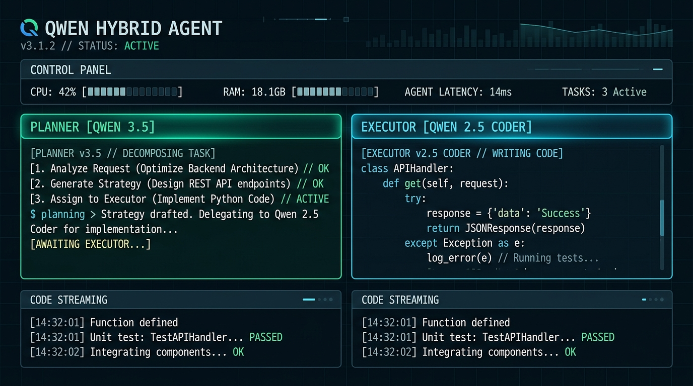
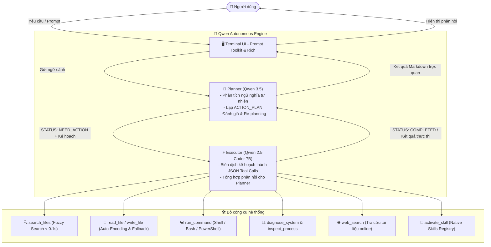

# 🤖 Qwen Hybrid Agent

<p align="center">
  
</p>

<p align="center">
  <strong>Trợ lý lập trình & Điều phối hệ thống tự chủ với kiến trúc Đa mô hình (Dual-Model Synergy) chạy cục bộ qua Ollama.</strong>
</p>

<p align="center">
  
  
  
  
  
  
</p>

---

## 🌟 Giới thiệu tổng quan

**Qwen Hybrid Agent** là một tác nhân AI (Autonomous Agent) thế hệ mới vận hành trực tiếp trên Terminal (TUI). Dự án khai thác sức mạnh hiệp đồng giữa hai mô hình lớn chuyên biệt:

1. **Planner & Architect (`qwen3.5:latest`)**: Đóng vai trò là "Bộ não chiến lược", phân tích ý định người dùng, chia tách bài toán phức tạp thành các kế hoạch hành động cụ thể (`[ACTION_PLAN]`) và nghiệm thu kết quả.
2. **Executor & System Engineer (`qwen2.5-coder:7b`)**: Đóng vai trò là "Cánh tay thực thi", chuyển hóa kế hoạch thành các công cụ gọi hàm (Tool Calls) cụ thể, can thiệp trực tiếp vào tệp tin, tiến trình, tài nguyên và câu lệnh hệ thống.

Toàn bộ hệ thống chạy **100% Offline / Local** thông qua Ollama, bảo mật tuyệt đối mã nguồn và dữ liệu cá nhân.

---

## 🏗️ Kiến trúc hoạt động (Dual-Model Synergy)



---

## ✨ Tính năng nổi bật

- ⚡ **Kiến trúc 2 bộ não tự chủ (Dual-Model Synergy)**: Tách biệt tư duy chiến lược và thực thi kỹ thuật giúp hạn chế tối đa hiện tượng ảo giác (hallucination) và tăng tốc độ xử lý.
- 🗂️ **Fuzzy Search siêu tốc**: Quét và định vị file trong hệ thống chỉ mất chưa tới 0.1s, hỗ trợ ánh xạ thông minh đường dẫn Linux WSL sang ổ đĩa Windows (`/mnt/c/...`).
- 🛡️ **I/O Tệp Siêu Bền Vững (Robust File Handling)**: Tự động phát hiện đa bảng mã (`utf-8`, `utf-16`, `cp1252`, `latin-1`), cơ chế fallback qua PowerShell/`cat` khi gặp các tệp tin bị khóa quyền (Permission Lock).
- 🧩 **Hệ thống Native Skills mở rộng**: Dễ dàng nhúng các kỹ năng chuyên biệt thông qua thư mục `skills/`:
  - `code-architect`: Thiết kế kiến trúc phần mềm, mẫu thiết kế (Design Patterns).
  - `fullstack-dev`: Phát triển ứng dụng Web fullstack hiện đại.
  - `system-expert`: Quản trị, giám sát và tối ưu hóa hệ điều hành Linux/WSL/Windows.
  - `troubleshoot-crash`: Chẩn đoán crash dump, phân tích log lỗi chuyên sâu.
  - `vn-office-standard`: Soạn thảo và chuẩn hóa văn bản hành chính theo Nghị định 30/2020/NĐ-CP & Thể thức 2026.
- 💻 **Terminal UI (TUI) chuyên nghiệp**: Hỗ trợ tự động gợi ý lệnh gạch chéo (`/`), màu sắc giao diện theo chuẩn Cyber Minimalist, hiển thị Markdown trực quan.

---

## 🚀 Cài đặt và Bắt đầu nhanh

### 1. Yêu cầu hệ thống
- **Hệ điều hành**: Linux hoặc Windows (WSL2 khuyên dùng)
- **Python**: 3.11+
- **Quản lý gói**: [`uv`](https://docs.astral.sh/uv/)
- **Ollama**: Đã cài đặt và đang chạy dịch vụ tại `http://localhost:11434`

### 2. Tải mô hình qua Ollama
```bash
ollama pull qwen3.5:latest
ollama pull qwen2.5-coder:7b
```

### 3. Cài đặt các gói phụ thuộc
Sử dụng `uv` để đồng bộ môi trường siêu tốc:
```bash
git clone https://github.com/llIIllIID0EIIllIIll/qwen-agent.git
cd qwen-agent

# Cài đặt thư viện bằng uv
uv sync
```

### 4. Khởi chạy Agent
```bash
# Cách 1: Chạy trực tiếp qua uv
uv run python agent_tui.py

# Cách 2: Sử dụng file script
chmod +x run.sh
./run.sh
```

---

## ⌨️ Lệnh Slash Commands hỗ trợ

Trong giao diện tương tác, bạn có thể gõ `/` để mở menu lệnh nhanh:

| Lệnh | Mô tả chi tiết |
| :--- | :--- |
| `/model` | Hiển thị và kiểm tra trạng thái phân công mô hình Planner vs Executor |
| `/skills` | Danh sách và thông tin chi tiết các Native Skills đang nạp trong hệ thống |
| `/system` | Báo cáo tài nguyên phần cứng thời gian thực: CPU, RAM, Disk usage |
| `/history` | Kiểm tra độ dài ngữ cảnh và số lượng tin nhắn trong phiên hiện tại |
| `/clear` | Xóa sạch màn hình terminal và làm mới vùng làm việc |
| `/reset` | Đặt lại toàn bộ phiên hội thoại về trạng thái khởi tạo ban đầu |
| `/help` | Xem trợ giúp và danh sách hướng dẫn chi tiết |
| `/exit` | Thoát khỏi chương trình |

---

## ⚙️ Biến môi trường tùy chỉnh

Bạn có thể thay đổi mô hình hoặc địa chỉ máy chủ Ollama thông qua biến môi trường:

```bash
export OLLAMA_BASE_URL="http://localhost:11434"
export PLANNER_MODEL="qwen3.5:latest"
export EXECUTOR_MODEL="qwen2.5-coder:7b"
```

---

## 📂 Cấu trúc thư mục

```plaintext
qwen-agent/
├── assets/
│   └── banner.jpg               # Banner minh họa TUI
├── skills/                      # Native Skills định nghĩa bằng Markdown
│   ├── code-architect/          # Kỹ năng thiết kế kiến trúc hệ thống
│   ├── fullstack-dev/           # Kỹ năng lập trình fullstack
│   ├── system-expert/           # Kỹ năng kỹ sư hệ thống
│   ├── troubleshoot-crash/      # Kỹ năng chẩn đoán sự cố & crash
│   └── vn-office-standard/      # Chuẩn thể thức văn bản hành chính VN
├── agent_tui.py                 # Mã nguồn TUI & hạt nhân điều phối chính
├── main.py                      # Điểm vào chương trình
├── pyproject.toml               # Cấu hình dự án & dependencies
├── run.sh                       # Script chạy nhanh
├── uv.lock                      # Khóa phiên bản gói phụ thuộc
└── README.md                    # Tài liệu dự án
```

---

## 📄 Bản quyền (License)

Dự án được phân phối dưới giấy phép [MIT License](LICENSE). Tự do sử dụng, chỉnh sửa và tích hợp vào các giải pháp cá nhân hoặc doanh nghiệp.
